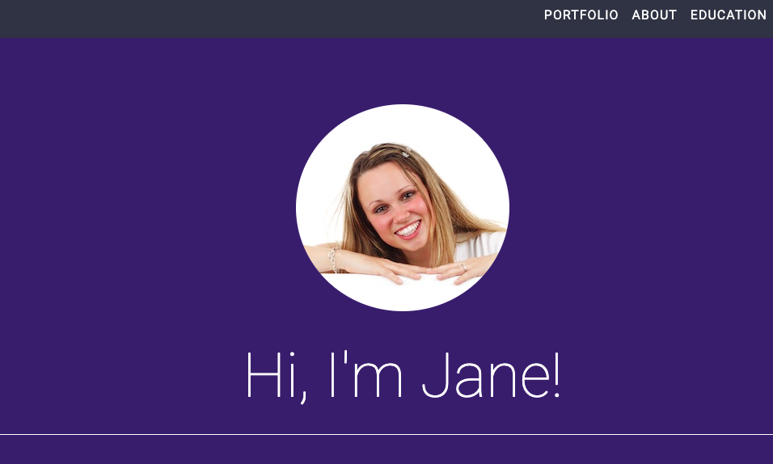
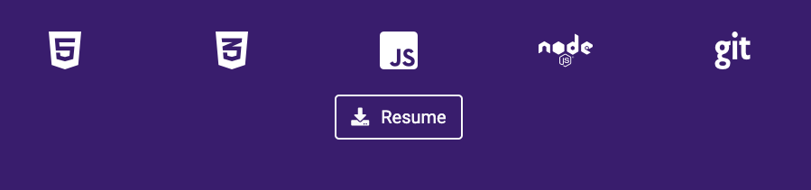

# Portfolio

> Live link: [https://janedoe.com](#)

## Purpose
This portfolio is used to showcase my work as a full-stack developer. I am currently open to new roles and opportunities!

## Technologies
HTML5, CSS3, Bootstrap, FontAwesome, Google Fonts

## Screenshots
 
### This is the header section

### This section provides a visual of my tech stack and skills

## Instructions
This code has an open MIT license and can be used as you wish:

1. `git clone https://github.com/trilogy-careerservices/Homework-1.git`
2. There are no packages to install.
3. Replace the Google Font and Font Awesome CDNs with your own
4. Enjoy! 

## Contact
*Full-stack Web Software Developer*
- Name: Jane Doe (@jdoe)
- Homepage: janedoe.com
- e-mail: janedoe@example.com
- Twitter: @janedoe
- LinkedIn: [https://www.linkedin.com/in/janedoe/](https://www.linkedin.com/in/janedoe/)